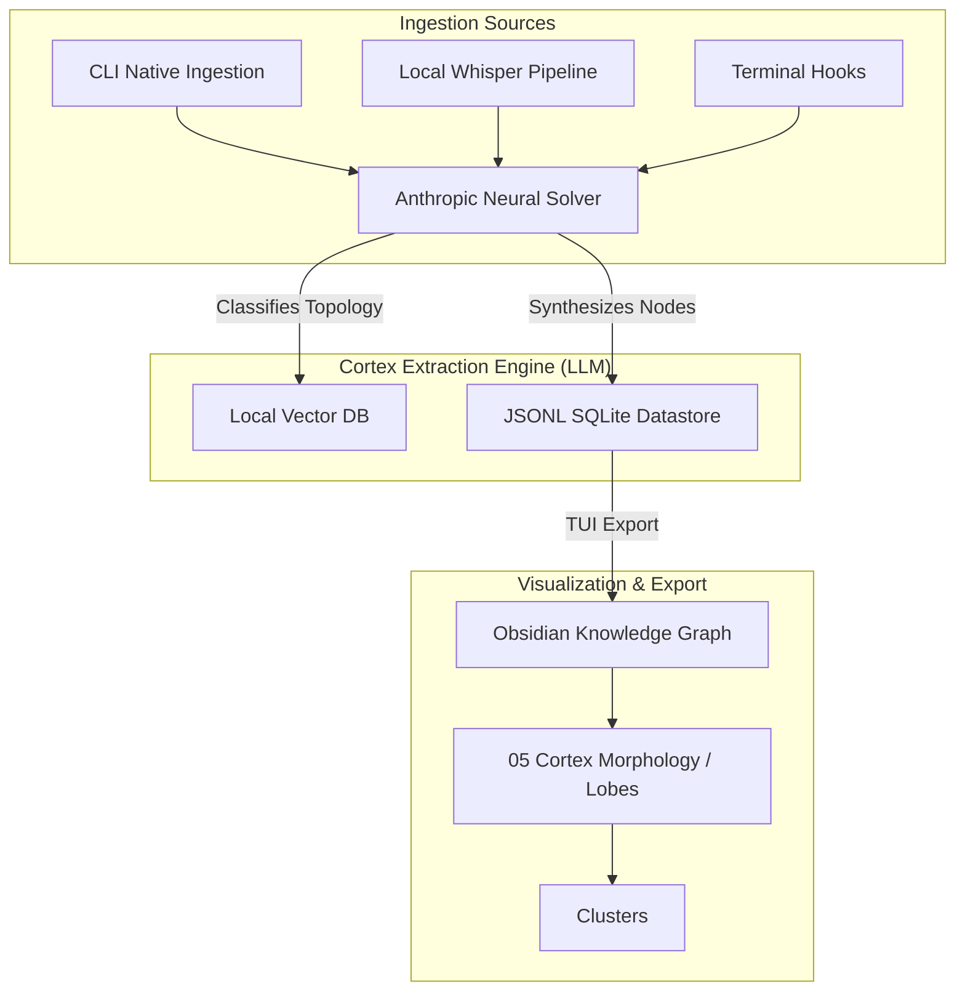

<div align="center">

# Cortex OS – The Biological AI Memory Engine

[](https://github.com/robertogogoni/cortex-claude/releases)
[](LICENSE)
[]()
[]()
[]()

**A local-first, biomechanically-inspired persistent memory system. Complete with an interactive TUI, native Obsidian Vault routing, and standalone offline ingestion.**

</div>

## Overview
AI agents traditionally suffer from context-window amnesia. They forget prior sessions, architectural decisions, and personal idioms the moment a script ends. **Cortex** fixes this biologically.

By substituting static flat-file logging with an autonomous, spatial memory topology, Cortex ingests multi-modal input (text & audio), routes inferences using an internal LLM extraction engine, and mathematically maps knowledge into an **Obsidian-ready Graph Network**.

### The Cortex Morphology (Neural Topography)
Cortex discards traditional folder structures. Knowledge is routed biologically into neural geometries:
- **`[Lobe]`** — The highest structural group (e.g. `Engineering`, `Prefrontal`, `Temporal`). 
- **`[Region]`** — The domain classification (e.g. `Troubleshooting`, `Data Processing`).
- **`[Cluster]`** — The synaptic target containing isolated, immutable atomic facts.



---

## Key Features

- **Biological Extraction Algorithm:** Raw session memories are piped into `claude-3-5-sonnet` and translated into precise biomechanical arrays containing tags, confidence limits, and neural routing coordinates.
- **Local Audio Pipeline (Whisper-Tiny):** Fully off-grid speech-to-text ingestion powered by local `@xenova/transformers` utilizing robust multi-modal data gathering.
- **TUI Governance Dashboard:** Complete system management from the terminal. Trigger backups, query hybrid search parameters, or audit internal memories using an interactive Clack-style TUI.
- **Direct Obsidian Graphing:** Automatically dynamically exports topological memories into a fully styled, glassmorphism-enabled Obsidian graphical vault for unparalleled UI mapping.
- **Multi-Adapter Abstraction:** Fetches historical context spanning multiple frameworks dynamically (CLAUDE.md, Project memory, SQLite vectors).

---

## Quick Start & Installation

### 1. Global Installation
```bash
git clone https://github.com/robertogogoni/cortex-claude.git ~/.cortex
cd ~/.cortex
npm install
npm run install-tui
```

### 2. Environment Configuration
Cortex's neural reasoning runs on Anthropic. You must supply an API key to permit automated topography solving.
```bash
export ANTHROPIC_API_KEY="sk-ant-..."
```

### 3. Launch the Dashboard
Summon the full interactive CLI anywhere from your terminal:
```bash
cortex-tui
```

---

## Cortex Terminal UI (TUI)

The Cortex TUI (`cortex-tui`) allows zero-friction operations across your entire knowledge environment:
1. **🔍 Query Hybrid Search:** Combine FTS5 Keyword filtering with dense Vector Reciprocal Rank Fusion embeddings.
2. **🎤 Ingest Knowledge:** Drag and drop audio files, transcripts, or code blocks into the engine.
3. **📁 Export Obsidian Vault:** Dump your neural network directly into your local Obsidian graph for visualization.
4. **🧠 Neural Migration:** Audit your database and geometrically assign any "flat" or legacy memories to their correct biomechanical structures.

---

## API Endpoints (For Third-Party Connectivity)

If you are developing your own HUD or frontend UI, Cortex fully supports REST endpoints natively. You can launch the server using `npm run cortex` on port `4000`.

- `POST /api/query` 
  ```json
  { "prompt": "How did I deploy the AWS bucket?", "domain": "engineering" }
  ```
- `GET /api/memories`

---

## Contribution & Audit Logging

Cortex is fundamentally designed with zero-cost scaling and `Request Feedback` limitations in mind. Ensure you execute `npm run test` against the system prior to resolving pull requests as the `ExtractionEngine` validates structural compliance heavily against mock SDK integrations.

## License
MIT License. See [LICENSE](LICENSE) for full open-source permissions.
