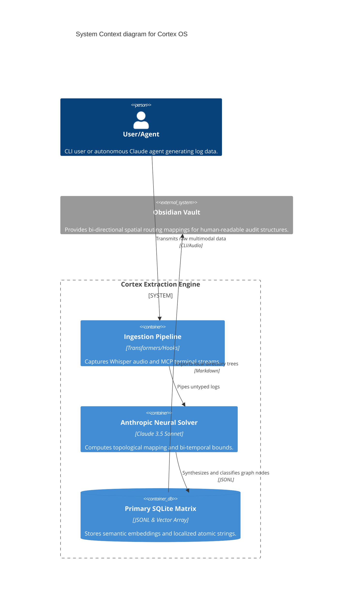

<div align="center">

# 🧠 Cortex OS
### The Biological AI Memory Engine

```bash
curl -fsSL raw.github.com/robertogogoni/cortex-claude/master/install.sh | bash
```

**A local-first, biomechanically-inspired persistent memory system.**
*Equipped with an interactive TUI, dynamic Obsidian Vault spatial routing, and offline multi-modal ingestion.*

[⚡ Quick Start](#-tutorials-quick-start) &nbsp; • &nbsp; [💻 Usage](#-how-to-interactive-cli) &nbsp; • &nbsp; [🔌 API Reference](#-reference-api-specs--key-systems) &nbsp; • &nbsp; [🧬 Architecture](#-explanation-neural-topography)

<br />

[](https://github.com/robertogogoni/cortex-claude/releases)
[](https://github.com/robertogogoni/cortex-claude/actions)

[](LICENSE)

</div>

---

<br />

## ⚡ Tutorials: Quick Start

### 1. Global Installation
Bootstrap the entire Cortex cognitive layer and Terminal UI onto your machine dynamically with a single command.
```bash
curl -fsSL raw.github.com/robertogogoni/cortex-claude/master/install.sh | bash
```
*(This automatically clones the repo, installs dependencies, maps configurations, registers the local MCP layer, and injects the telemetry hooks.)*

### 2. Environment Configuration
Cortex's neural reasoning uses the Anthropic Engine. Provide an API key to allow topography synthesis.
```bash
export ANTHROPIC_API_KEY="sk-ant-..."
```

### 3. Launch TUI Dashboard
Pull up the biological interface directly from the terminal layer globally.
```bash
cortex-tui
```

<br />

---

## 💻 How-To: Interactive CLI

The Cortex CLI enables absolute graphical, highly-responsive offline systems maintenance over your mapped cognitive layers. From here, you possess absolute read/write supremacy over your nodes.

- **`🔍 Query Engine`** – Invoke Hybrid-Search executing reciprocal rank fusions combining dense vectorized data to pinpoint semantic facts.
- **`🎤 Ingest Data`** – Deposit hard data, voice logs, and syntax directly into the network.
- **`📁 Build Vault`** – Rip your biological network locally into an Obsidian environment mapping.
- **`🧠 Node Migration`** – Clean up rogue, legacy, or fragmented directories assigning them topographical positions.

<br />

---

## 🔌 Reference: API Specs & Key Systems

Cortex is architecturally abstracted extending its network over standard Web API sockets to assist 3rd Party HUD developments and multi-agent coordination. Boot `npm run cortex` locally to bind port `:4000`.

**Query Route:**
```bash
curl -X POST http://localhost:4000/api/query \
  -H "Content-Type: application/json" \
  -d '{"prompt": "How did I deploy the AWS bucket?", "domain": "engineering"}'
```

### Core Execution Matrix
| Feature Layer | Core Execution Engine | Operations Detail |
| :--- | :--- | :--- |
| **Biological Algorithms** | `claude-3-5-sonnet` | Translates raw text boundaries into highly precise biomechanical arrays with limits, weights, and node routing algorithms. |
| **Local Whisper Pipeline** | `@xenova/transformers` | Off-grid speech-to-text pipeline utilizing lightweight transformer models for highly secure, multi-modal audio captures. |
| **Dashboard Interface** | `@inquirer/prompts` | Terminal-UI (TUI) allowing offline audit querying, data ingesting, explicit memory migrations, and hardware back-ups. |
| **Obsidian Integration** | `Vanilla Javascript` | Translates topographical memories dynamically into localized markdown layouts complete with styling and bi-directional indexing. |

<br />

---

## 🧬 Explanation: Neural Topography

AI agents traditionally suffer from context-window amnesia. They forget prior sessions, architectural decisions, and personal idioms the moment a session ends. **Cortex OS** resolves this biologically.

By converting static log dumping into an **autonomous, spatial memory topology**, Cortex ingests multi-modal input (text & audio), computes structural inference using `claude-3-5-sonnet`, and mathematically anchors knowledge into a natively generated **Obsidian Knowledge Graph**.

It completely discards generic folder logic in favor of geometric neural routing arrays:
* **`[Lobe]`** — The highest structural group (e.g., `Engineering`, `Prefrontal`, `Temporal`). 
* **`[Region]`** — The operational domain classification (e.g., `Data Processing`, `UX Design`).
* **`[Cluster]`** — The synaptic target containing isolated, immutable atomic context.

<br />

### C4 Container Architecture

<div align="center">



</div>

<br />

---

## 📚 Theoretical Grounding

Cortex operates robustly because it inherits its methodology directly from verified academic research frameworks rather than experimental guesswork:

- **HyDE (Hypothetical Document Embeddings)** *[Gao et al., 2022]*: Cortex utilizes reciprocal rank fusion across hypothetically generated documents to execute zero-shot vector searches, allowing precision recall without fine-tuning bounds.
- **Generative Agents: Interactive Simulacra** *[Park et al., 2023]*: We bypass basic vector storage in favor of Lobe/Cluster spatial topography, adopting the methodology of mapping agentic memories into structured, spatial environments for rapid associative recall.
- **MemGPT** *[Packer et al., 2023]*: By segmenting data autonomously via a background execution layer, Cortex bypasses hard context limitations, effectively acting as an Operating System for LLM memory paging.

<br />

---

## 🛡️ Telemetry & Security
This project ships rigorously tested CI/CD matrices to ensure `ExtractionEngine` integrity via Anthropic Mock protocols. Any pull request modification to `core` mechanics will be systematically rejected if `npm run test` generates structural variance errors against the graph engine.

<div align="center">
  <br />
  <p>Maintained securely under the <b>MIT License</b>.</p>
</div>
