# Cortex v3.0 Full Transformation Implementation Plan

> **For Claude:** REQUIRED SUB-SKILL: Use superpowers:executing-plans to implement this plan task-by-task.

**Goal:** Transform Cortex from a dual-model memory system into a zero-cost, self-healing, visually stunning Claude Code memory OS with MCP Sampling, PreCompact preservation, bi-temporal knowledge, write gates, and plugin packaging.

**Architecture:** Cortex v3.0 eliminates the ANTHROPIC_API_KEY dependency by leveraging MCP Sampling for all LLM calls, adds triple-hook capture (Stop + PreCompact + SessionEnd), implements bi-temporal memory with confidence decay, and packages everything as an installable Claude Code plugin. The visual pipeline is fixed so users actually see the neural themes.

**Tech Stack:** Node.js (CommonJS), @modelcontextprotocol/sdk v2 (Sampling + Elicitation), better-sqlite3, hnswlib-node, @xenova/transformers, ANSI terminal colors

**Research Sources:**
- [MCP Spec 2025-11-25](https://modelcontextprotocol.io/specification/2025-11-25)
- [MCP TypeScript SDK v2](https://github.com/modelcontextprotocol/typescript-sdk)
- [total-recall (write gates)](https://github.com/davegoldblatt/total-recall)
- [Vestige (FSRS-6, HyDE)](https://github.com/samvallad33/vestige)
- [Graphiti/Zep (bi-temporal)](https://github.com/getzep/graphiti)
- [Memento MCP (confidence decay)](https://github.com/gannonh/memento-mcp)
- [memory-mcp (triple-hook)](https://github.com/yuvalsuede/memory-mcp)
- [mvara-ai/precompact-hook](https://github.com/mvara-ai/precompact-hook)
- [Everything Claude Code (hook patterns)](https://github.com/affaan-m/everything-claude-code)
- [MemOS Paper (arXiv:2507.03724)](https://arxiv.org/pdf/2507.03724)
- [A-MEM (NeurIPS 2025)](https://arxiv.org/abs/2502.12110)

---

## Phase A: Ship (Quick Wins + README + First Release)

**Estimated effort:** 1-2 days
**Goal:** Get v2.0.0 properly released with critical fixes and a transformed README.

---

### Task A1: Fix Version Mismatch in MCP Server

**Files:**
- Modify: `cortex/server.cjs:100`

**Step 1: Write the failing test**

```javascript
// tests/quick-wins.test.cjs (append to existing)
test('MCP server version matches package.json', () => {
  const pkg = require('../package.json');
  // The server declares version in Server constructor at line ~100
  const serverSource = require('fs').readFileSync(
    require('path').join(__dirname, '../cortex/server.cjs'), 'utf8'
  );
  const match = serverSource.match(/version:\s*'([^']+)'/);
  assert(match, 'Version string found in server.cjs');
  assert.strictEqual(match[1], pkg.version, `Server version ${match[1]} should match package.json ${pkg.version}`);
});
```

**Step 2: Run test to verify it fails**

Run: `node tests/quick-wins.test.cjs`
Expected: FAIL — `Server version 1.0.0 should match package.json 2.0.0`

**Step 3: Fix the version**

In `cortex/server.cjs`, line 100, change:
```javascript
// FROM:
version: '1.0.0',
// TO:
version: '2.0.0',
```

**Step 4: Run test to verify it passes**

Run: `node tests/quick-wins.test.cjs`
Expected: PASS

**Step 5: Commit**

```bash
git add cortex/server.cjs tests/quick-wins.test.cjs
git commit -m "fix: version mismatch in MCP server (1.0.0 → 2.0.0)"
```

---

### Task A2: Fix Default Injection Format to Neural

**Files:**
- Modify: `hooks/injection-formatter.cjs:238-242` (InjectionFormatter constructor)
- Modify: `hooks/injection-formatter.cjs:341` (hardcoded 'rich' in format call)
- Modify: `hooks/injection-formatter.cjs:552` (default parameter)

**Step 1: Write the failing test**

```javascript
// tests/test-hooks.cjs (append to existing)
test('InjectionFormatter defaults to neural format', () => {
  const { InjectionFormatter } = require('../hooks/injection-formatter.cjs');
  const formatter = new InjectionFormatter();
  assert.strictEqual(formatter.format, 'neural', 'Default format should be neural, not rich');
});
```

**Step 2: Run test to verify it fails**

Run: `node tests/test-hooks.cjs`
Expected: FAIL — format is `undefined` or `'rich'`

**Step 3: Update InjectionFormatter constructor and format defaults**

In `hooks/injection-formatter.cjs`, in the InjectionFormatter constructor (around line 242), ensure:
```javascript
constructor(options = {}) {
  this.format = options.format || 'neural';  // Changed from 'rich' to 'neural'
  // ... rest of constructor
}
```

At line 341, change:
```javascript
// FROM:
const formattedMemory = this._formatSingleMemory(memory, 'rich');
// TO:
const formattedMemory = this._formatSingleMemory(memory, this.format || 'neural');
```

At line 552, change:
```javascript
// FROM:
_formatSingleMemory(memory, style = 'rich') {
// TO:
_formatSingleMemory(memory, style = 'neural') {
```

**Step 4: Run test to verify it passes**

Run: `node tests/test-hooks.cjs`
Expected: PASS

**Step 5: Commit**

```bash
git add hooks/injection-formatter.cjs tests/test-hooks.cjs
git commit -m "fix: default injection format to 'neural' instead of 'rich'"
```

---

### Task A3: Add GitHub Topics and Badges

**Files:**
- Modify: `README.md` (top section)

**Step 1: Set GitHub topics via CLI**

```bash
gh repo edit robertogogoni/cortex-claude --add-topic "claude-code,mcp,memory,persistent-memory,ai,llm,hooks,cross-session,dual-model,cognitive-layer"
```

**Step 2: Add badge cluster to README.md top**

Replace the first lines of `README.md` with:
```markdown
<div align="center">

# Cortex - Claude's Cognitive Layer

[](https://github.com/robertogogoni/cortex-claude/releases)
[](LICENSE)
[](https://nodejs.org/)
[](https://modelcontextprotocol.io/)
[](tests/)

**Persistent cross-session memory for Claude Code with dual-model AI reasoning**

[Quick Start](#quick-start) | [How It Works](#architecture) | [Commands](#commands) | [Roadmap](ROADMAP.md)

</div>
```

**Step 3: Add Problem/Solution table after badges**

```markdown
## Why Cortex?

| Problem | How Others Solve It | How Cortex Solves It |
|---------|--------------------|--------------------|
| Claude forgets everything between sessions | CLAUDE.md files (manual) | **Auto-extraction** at session end + **auto-injection** at session start |
| Context lost when window compresses | Nothing (data lost forever) | **PreCompact hook** saves critical context before compression |
| Memory search is keyword-only | Basic text matching | **Hybrid vector search** (HNSW + BM25 + Reciprocal Rank Fusion) |
| No reasoning about memories | Store and retrieve | **Dual-model**: Haiku queries + Sonnet reflects/infers/learns |
| Memory grows without limit | Manual cleanup | **LADS framework**: auto-consolidation, decay, tier promotion |
| No cost visibility | Hidden API costs | **Per-operation costs** shown: query ~$0.001, reflect ~$0.01 |
```

**Step 4: Add Mermaid architecture diagram**

Replace the ASCII architecture diagram with:
````markdown
## Architecture

```mermaid
graph TB
    subgraph "Claude Code Session"
        CC[Claude Code] -->|SessionStart| SS[Session Start Hook]
        CC -->|SessionEnd| SE[Session End Hook]
        CC -->|PreCompact| PC[PreCompact Hook]
        CC -->|MCP Tools| MCP[Cortex MCP Server]
    end

    subgraph "Dual-Model Engine"
        MCP -->|Fast queries| H[Haiku Worker<br/>~$0.001/call]
        MCP -->|Deep reasoning| S[Sonnet Thinker<br/>~$0.01/call]
    end

    subgraph "Memory Layers"
        H --> WM[Working Memory<br/>< 24h, max 50]
        H --> ST[Short-Term<br/>1-7 days, max 200]
        H --> LT[Long-Term<br/>Permanent, quality-filtered]
        S --> INS[Insights & Learnings]
    end

    subgraph "Search Engine"
        H --> VS[Vector Search<br/>HNSW + BM25]
        VS --> RRF[Reciprocal Rank Fusion]
    end

    SE -->|Extract| EE[Extraction Engine]
    EE -->|Store| WM
    WM -->|Promote| ST
    ST -->|Promote| LT
```


````

**Step 5: Add competitor comparison matrix**

```markdown
## How Cortex Compares

| Feature | Cortex | server-memory | mcp-memory-service | Vestige | total-recall |
|---------|--------|---------------|-------------------|---------|-------------|
| Dual-model reasoning | :white_check_mark: | :x: | :x: | :x: | :x: |
| MCP Tools | :white_check_mark: 7 | :x: | :white_check_mark: 13 | :white_check_mark: 21 | :x: |
| MCP Resources | :white_check_mark: | :x: | :x: | :x: | :x: |
| MCP Prompts | :white_check_mark: | :x: | :x: | :x: | :x: |
| Session Hooks | :white_check_mark: 3 | :x: | :x: | :x: | :white_check_mark: 2 |
| Vector Search | :white_check_mark: Hybrid | :x: | :white_check_mark: | :white_check_mark: HNSW | :x: |
| Auto-extraction | :white_check_mark: | :x: | :x: | :x: | :x: |
| Tier Promotion | :white_check_mark: 3-tier | :x: | :x: | :x: | :white_check_mark: 4-tier |
| LADS Framework | :white_check_mark: | :x: | :x: | :x: | :x: |
| Write Gates | Phase C | :x: | :x: | :white_check_mark: | :white_check_mark: |
| Confidence Decay | Phase C | :x: | :x: | :white_check_mark: FSRS-6 | :x: |
| Zero dependencies | :x: (SQLite+HNSW) | :white_check_mark: | :x: (ChromaDB) | :white_check_mark: (Rust) | :white_check_mark: (Markdown) |
```

**Step 6: Commit README changes**

```bash
git add README.md
git commit -m "docs: transform README with badges, mermaid diagram, competitor matrix"
```

---

### Task A4: Create First GitHub Release

**Step 1: Ensure all tests pass**

```bash
cd /path/to/cortex-claude
node tests/test-core.cjs && node tests/test-hooks.cjs && echo "All tests pass"
```

**Step 2: Create release tag**

```bash
git tag -a v2.0.0 -m "Cortex v2.0.0 - Claude's Cognitive Layer

Dual-model memory system with:
- 7 MCP tools (query, recall, reflect, infer, learn, consolidate, health)
- 7 memory adapters (SQLite, HNSW, JSONL, episodic, knowledge-graph, etc.)
- Hybrid vector search (HNSW + BM25 + RRF)
- Auto-extraction at session end
- Auto-injection at session start
- 3-tier memory promotion (working → short-term → long-term)
- LADS framework (self-improving)
- Neural visual themes (4 rotating themes, 120+ phrases)
- 142/142 tests passing"
```

**Step 3: Push tag and create GitHub release**

```bash
git push origin v2.0.0
gh release create v2.0.0 --title "Cortex v2.0.0 - Claude's Cognitive Layer" --notes-file - <<'EOF'
## Highlights

- **Dual-Model Architecture**: Haiku for fast queries (~$0.001), Sonnet for deep reasoning (~$0.01)
- **7 MCP Tools**: query, recall, reflect, infer, learn, consolidate, health
- **Hybrid Vector Search**: HNSW + BM25 with Reciprocal Rank Fusion
- **Auto-Extraction**: Learns from every session automatically
- **3-Tier Memory**: Working → Short-Term → Long-Term with quality-based promotion
- **LADS Framework**: Learnable, Adaptive, Documenting, Self-improving
- **Neural Themes**: 4 rotating visual themes with 120+ whimsical phrases

## Installation

```bash
git clone https://github.com/robertogogoni/cortex-claude.git ~/.claude/memory
cd ~/.claude/memory && npm install
node scripts/install-hooks.cjs
```

See [QUICKSTART.md](QUICKSTART.md) for full setup guide.
EOF
```

**Step 4: Commit**

No additional commit needed — release is a GitHub-only operation.

---

### Task A5: Commit Local Changelog

**Files:**
- Stage: `~/.claude/memory/docs/changelog.md`

**Step 1: Check diff**

```bash
cd ~/.claude/memory
git diff --stat docs/changelog.md
```

**Step 2: Commit if meaningful**

```bash
git add docs/changelog.md
git commit -m "docs: add LADS initialization changelog from active sessions"
git push
```

---

## Phase B: Core Engine (MCP Sampling + Triple-Hook + Visual Fix)

**Estimated effort:** 4-6 days
**Goal:** Eliminate ANTHROPIC_API_KEY requirement, add PreCompact hook, fix visual pipeline.

---

### Task B1: Create MCP Sampling Adapter

**Files:**
- Create: `cortex/sampling-adapter.cjs`
- Test: `tests/test-sampling-adapter.cjs`

**Step 1: Write the failing test**

```javascript
// tests/test-sampling-adapter.cjs
'use strict';
const assert = require('assert');

// Mock MCP server context
class MockMcpContext {
  constructor() {
    this.lastRequest = null;
    this.response = { role: 'assistant', content: { type: 'text', text: 'mock response' }, model: 'claude-haiku' };
  }
  async requestSampling(params) {
    this.lastRequest = params;
    return this.response;
  }
}

async function testSamplingAdapter() {
  const { SamplingAdapter } = require('../cortex/sampling-adapter.cjs');

  // Test 1: Creates adapter with context
  const ctx = new MockMcpContext();
  const adapter = new SamplingAdapter({ mcpContext: ctx });
  assert(adapter, 'Adapter created');

  // Test 2: Haiku-speed request sets speedPriority high
  const result = await adapter.complete('Test prompt', { speed: 'fast' });
  assert.strictEqual(ctx.lastRequest.modelPreferences.speedPriority, 0.9);
  assert.strictEqual(ctx.lastRequest.modelPreferences.intelligencePriority, 0.3);
  assert(result.text, 'Got text response');

  // Test 3: Sonnet-depth request sets intelligencePriority high
  await adapter.complete('Deep analysis', { speed: 'deep' });
  assert.strictEqual(ctx.lastRequest.modelPreferences.speedPriority, 0.3);
  assert.strictEqual(ctx.lastRequest.modelPreferences.intelligencePriority, 0.9);

  // Test 4: Falls back to direct API if no MCP context
  const fallbackAdapter = new SamplingAdapter({ mcpContext: null, apiKey: 'test-key' });
  assert.strictEqual(fallbackAdapter.mode, 'api');

  // Test 5: maxTokens is respected
  await adapter.complete('Test', { speed: 'fast', maxTokens: 256 });
  assert.strictEqual(ctx.lastRequest.maxTokens, 256);

  console.log('All sampling adapter tests passed');
}

testSamplingAdapter().catch(err => { console.error(err); process.exit(1); });
```

**Step 2: Run test to verify it fails**

Run: `node tests/test-sampling-adapter.cjs`
Expected: FAIL — `Cannot find module '../cortex/sampling-adapter.cjs'`

**Step 3: Implement SamplingAdapter**

```javascript
// cortex/sampling-adapter.cjs
'use strict';

/**
 * SamplingAdapter - Unified LLM completion interface
 *
 * Prefers MCP Sampling (zero-cost, uses host Claude) with automatic
 * fallback to direct Anthropic API (paid, requires ANTHROPIC_API_KEY).
 *
 * MCP Sampling: server.requestSampling() → host Claude handles it → free
 * Direct API: new Anthropic().messages.create() → billed → requires key
 */
class SamplingAdapter {
  constructor(options = {}) {
    this.mcpContext = options.mcpContext || null;
    this.apiKey = options.apiKey || process.env.ANTHROPIC_API_KEY || null;
    this.mode = this.mcpContext ? 'sampling' : (this.apiKey ? 'api' : 'none');
  }

  /**
   * Send a completion request
   * @param {string} prompt - The prompt text
   * @param {Object} options
   * @param {'fast'|'deep'} options.speed - 'fast' hints Haiku, 'deep' hints Sonnet
   * @param {number} options.maxTokens - Max response tokens (default: 1024)
   * @param {string} options.systemPrompt - Optional system prompt
   * @returns {Promise<{text: string, model: string, mode: string}>}
   */
  async complete(prompt, options = {}) {
    const { speed = 'fast', maxTokens = 1024, systemPrompt = null } = options;

    if (this.mode === 'sampling') {
      return this._viaSampling(prompt, { speed, maxTokens, systemPrompt });
    } else if (this.mode === 'api') {
      return this._viaAPI(prompt, { speed, maxTokens, systemPrompt });
    } else {
      throw new Error('No LLM backend available: set MCP context or ANTHROPIC_API_KEY');
    }
  }

  async _viaSampling(prompt, { speed, maxTokens, systemPrompt }) {
    const messages = [{ role: 'user', content: { type: 'text', text: prompt } }];

    const modelPreferences = speed === 'deep'
      ? { hints: [{ name: 'claude-sonnet' }], intelligencePriority: 0.9, speedPriority: 0.3 }
      : { hints: [{ name: 'claude-haiku' }], intelligencePriority: 0.3, speedPriority: 0.9 };

    const params = { messages, modelPreferences, maxTokens };
    if (systemPrompt) params.systemPrompt = systemPrompt;

    const result = await this.mcpContext.requestSampling(params);

    const text = typeof result.content === 'string'
      ? result.content
      : (result.content?.text || JSON.stringify(result.content));

    return { text, model: result.model || 'unknown', mode: 'sampling' };
  }

  async _viaAPI(prompt, { speed, maxTokens, systemPrompt }) {
    const Anthropic = require('@anthropic-ai/sdk').default;
    const client = new Anthropic({ apiKey: this.apiKey });

    const model = speed === 'deep' ? 'claude-sonnet-4-20250514' : 'claude-3-5-haiku-20241022';

    const params = {
      model,
      max_tokens: maxTokens,
      messages: [{ role: 'user', content: prompt }],
    };
    if (systemPrompt) params.system = systemPrompt;

    const response = await client.messages.create(params);
    const text = response.content[0]?.text || '';

    return { text, model: response.model, mode: 'api' };
  }
}

module.exports = { SamplingAdapter };
```

**Step 4: Run test to verify it passes**

Run: `node tests/test-sampling-adapter.cjs`
Expected: PASS

**Step 5: Commit**

```bash
git add cortex/sampling-adapter.cjs tests/test-sampling-adapter.cjs
git commit -m "feat: add SamplingAdapter for zero-cost MCP Sampling with API fallback"
```

---

### Task B2: Integrate SamplingAdapter into HaikuWorker

**Files:**
- Modify: `cortex/haiku-worker.cjs`
- Modify: `cortex/server.cjs` (pass MCP context to workers)

**Step 1: Write the failing test**

```javascript
// tests/test-sampling-integration.cjs
'use strict';
const assert = require('assert');

async function testHaikuUseSampling() {
  // Verify HaikuWorker accepts samplingAdapter option
  const { HaikuWorker } = require('../cortex/haiku-worker.cjs');

  const mockAdapter = {
    complete: async (prompt, opts) => ({
      text: JSON.stringify({ intent: 'search', keywords: ['test'] }),
      model: 'haiku-mock',
      mode: 'sampling'
    })
  };

  const worker = new HaikuWorker({ samplingAdapter: mockAdapter });
  assert(worker.samplingAdapter, 'Worker accepts sampling adapter');
  assert.strictEqual(worker.samplingAdapter.mode || 'sampling', 'sampling');

  console.log('HaikuWorker sampling integration test passed');
}

testHaikuUseSampling().catch(err => { console.error(err); process.exit(1); });
```

**Step 2: Run test to verify it fails**

Run: `node tests/test-sampling-integration.cjs`
Expected: FAIL — `worker.samplingAdapter` is undefined

**Step 3: Modify HaikuWorker to accept and use SamplingAdapter**

In `cortex/haiku-worker.cjs`, in the HaikuWorker constructor, add:
```javascript
constructor(options = {}) {
  this.basePath = options.basePath || path.join(process.env.HOME, '.claude', 'memory');
  this.samplingAdapter = options.samplingAdapter || null;

  // Only create direct Anthropic client if no sampling adapter
  if (!this.samplingAdapter) {
    this.client = new Anthropic({
      apiKey: options.apiKey || process.env.ANTHROPIC_API_KEY,
    });
  }
  // ... rest of constructor
}
```

Then in every method that calls `this.client.messages.create()`, add a sampling-first path:
```javascript
async _callHaiku(prompt, maxTokens = MAX_TOKENS) {
  if (this.samplingAdapter) {
    const result = await this.samplingAdapter.complete(prompt, {
      speed: 'fast',
      maxTokens,
    });
    return result.text;
  }

  // Fallback to direct API
  const response = await this.client.messages.create({
    model: HAIKU_MODEL,
    max_tokens: maxTokens,
    messages: [{ role: 'user', content: prompt }],
  });
  return response.content[0]?.text || '';
}
```

**Step 4: Run test to verify it passes**

Run: `node tests/test-sampling-integration.cjs`
Expected: PASS

**Step 5: Apply same pattern to SonnetThinker**

In `cortex/sonnet-thinker.cjs`, make the same changes but with `speed: 'deep'`.

**Step 6: Update server.cjs to pass MCP context**

In `cortex/server.cjs`, in the `CallToolRequestSchema` handler, pass the request context:
```javascript
server.setRequestHandler(CallToolRequestSchema, async (request, ctx) => {
  // Create sampling adapter from MCP context
  const { SamplingAdapter } = require('./sampling-adapter.cjs');
  const samplingAdapter = new SamplingAdapter({ mcpContext: ctx.mcpReq });

  // Pass to workers if not already configured
  if (!haiku.samplingAdapter) haiku.samplingAdapter = samplingAdapter;
  if (!sonnet.samplingAdapter) sonnet.samplingAdapter = samplingAdapter;

  // ... rest of handler
});
```

Also update the server capabilities to declare sampling support:
```javascript
// In Server constructor capabilities, add:
capabilities: {
  tools: { listChanged: true },
  resources: { subscribe: false, listChanged: true },
  prompts: { listChanged: true },
  // Note: We REQUEST sampling from client, not provide it
}
```

**Step 7: Commit**

```bash
git add cortex/haiku-worker.cjs cortex/sonnet-thinker.cjs cortex/server.cjs tests/test-sampling-integration.cjs
git commit -m "feat: integrate MCP Sampling into HaikuWorker and SonnetThinker

Zero-cost LLM calls via host Claude when running as MCP server.
Automatic fallback to direct Anthropic API when ANTHROPIC_API_KEY is set.
Eliminates API key requirement for standard MCP usage."
```

---

### Task B3: Create PreCompact Hook

**Files:**
- Create: `hooks/pre-compact.cjs`
- Modify: `scripts/install-hooks.cjs` (register new hook)
- Test: `tests/test-pre-compact.cjs`

**Step 1: Write the failing test**

```javascript
// tests/test-pre-compact.cjs
'use strict';
const assert = require('assert');
const fs = require('fs');
const path = require('path');

async function testPreCompact() {
  const { PreCompactHook } = require('../hooks/pre-compact.cjs');

  // Test 1: Hook processes conversation messages
  const hook = new PreCompactHook({
    basePath: path.join(__dirname, 'fixtures/precompact'),
  });

  const input = {
    transcript_summary: 'Working on authentication system. Decided to use JWT with refresh tokens. Key insight: always validate expiry before checking permissions.',
    cwd: '/tmp/test-project',
  };

  const result = await hook.execute(input);
  assert(result.success, 'Hook executes successfully');
  assert(result.preserved > 0, 'Preserved at least one item');
  assert(result.items.length > 0, 'Has preserved items');

  // Test 2: Empty input doesn't crash
  const emptyResult = await hook.execute({});
  assert(emptyResult.success, 'Empty input handled gracefully');
  assert.strictEqual(emptyResult.preserved, 0);

  console.log('All PreCompact hook tests passed');
}

// Create fixtures dir
const fixturesDir = path.join(__dirname, 'fixtures/precompact/data/memories');
fs.mkdirSync(fixturesDir, { recursive: true });

testPreCompact().then(() => {
  // Cleanup
  fs.rmSync(path.join(__dirname, 'fixtures/precompact'), { recursive: true, force: true });
}).catch(err => {
  fs.rmSync(path.join(__dirname, 'fixtures/precompact'), { recursive: true, force: true });
  console.error(err);
  process.exit(1);
});
```

**Step 2: Run test to verify it fails**

Run: `node tests/test-pre-compact.cjs`
Expected: FAIL — `Cannot find module '../hooks/pre-compact.cjs'`

**Step 3: Implement PreCompact hook**

```javascript
// hooks/pre-compact.cjs
'use strict';

const fs = require('fs');
const path = require('path');
const { generateId, getTimestamp } = require('../core/types.cjs');

/**
 * PreCompact Hook
 *
 * Fires before Claude Code compresses conversation context.
 * Extracts and preserves critical information that would otherwise be lost.
 *
 * Input (stdin JSON):
 *   { transcript_summary: string, cwd: string }
 *
 * Uses heuristic extraction (no LLM calls) to stay fast.
 */
class PreCompactHook {
  constructor(options = {}) {
    this.basePath = options.basePath || path.join(process.env.HOME, '.claude', 'memory');
  }

  async execute(input = {}) {
    const summary = input.transcript_summary || '';
    const cwd = input.cwd || process.cwd();

    if (!summary || summary.length < 20) {
      return { success: true, preserved: 0, items: [] };
    }

    try {
      const items = this._extractCriticalInfo(summary);

      if (items.length > 0) {
        this._persistItems(items, cwd);
      }

      return {
        success: true,
        preserved: items.length,
        items: items.map(i => ({ type: i.type, preview: i.content.substring(0, 80) })),
      };
    } catch (error) {
      console.error('[PreCompact] Error:', error.message);
      return { success: false, preserved: 0, items: [], error: error.message };
    }
  }

  _extractCriticalInfo(summary) {
    const items = [];
    const sentences = summary.split(/[.!?\n]+/).filter(s => s.trim().length > 15);

    // Decision signals
    const decisionPatterns = [
      /decided to\s+(.+)/i, /chose\s+(.+)/i, /went with\s+(.+)/i,
      /using\s+(.+?)\s+(?:for|because|instead)/i, /switched to\s+(.+)/i,
    ];

    // Insight signals
    const insightPatterns = [
      /key insight:\s*(.+)/i, /important:\s*(.+)/i, /remember:\s*(.+)/i,
      /always\s+(.+?)\s+before/i, /never\s+(.+?)\s+without/i,
      /the (?:trick|key|secret) is\s+(.+)/i,
    ];

    // Error/fix signals
    const errorPatterns = [
      /(?:fixed|solved|resolved)\s+(?:by|with)\s+(.+)/i,
      /the (?:issue|problem|bug) was\s+(.+)/i,
      /(?:root cause|reason):\s*(.+)/i,
    ];

    for (const sentence of sentences) {
      const trimmed = sentence.trim();

      for (const pattern of decisionPatterns) {
        if (pattern.test(trimmed)) {
          items.push({ type: 'decision', content: trimmed, confidence: 0.8 });
          break;
        }
      }

      for (const pattern of insightPatterns) {
        if (pattern.test(trimmed)) {
          items.push({ type: 'insight', content: trimmed, confidence: 0.85 });
          break;
        }
      }

      for (const pattern of errorPatterns) {
        if (pattern.test(trimmed)) {
          items.push({ type: 'pattern', content: trimmed, confidence: 0.75 });
          break;
        }
      }
    }

    // Deduplicate by content similarity
    const unique = [];
    for (const item of items) {
      const isDupe = unique.some(u =>
        u.content.length > 0 && item.content.includes(u.content.substring(0, 30))
      );
      if (!isDupe) unique.push(item);
    }

    return unique.slice(0, 10); // Max 10 items per compaction
  }

  _persistItems(items, cwd) {
    const workingPath = path.join(this.basePath, 'data', 'memories', 'working.jsonl');
    const dir = path.dirname(workingPath);
    if (!fs.existsSync(dir)) fs.mkdirSync(dir, { recursive: true });

    const lines = items.map(item => JSON.stringify({
      id: generateId(),
      version: 1,
      type: item.type,
      content: item.content,
      summary: item.content.substring(0, 100),
      tags: ['pre-compact', item.type],
      extractionConfidence: item.confidence,
      usageCount: 0,
      usageSuccessRate: 0,
      decayScore: 1.0,
      status: 'active',
      sourceSessionId: 'pre-compact',
      sourceTimestamp: getTimestamp(),
      projectHash: this._hashCwd(cwd),
      createdAt: getTimestamp(),
      updatedAt: getTimestamp(),
    }));

    fs.appendFileSync(workingPath, lines.join('\n') + '\n');
  }

  _hashCwd(cwd) {
    const crypto = require('crypto');
    return crypto.createHash('md5').update(cwd).digest('hex').substring(0, 8);
  }

  _readStdin() {
    return new Promise((resolve) => {
      if (process.stdin.isTTY) { resolve({}); return; }
      let data = '';
      const timeout = setTimeout(() => {
        try { resolve(data ? JSON.parse(data) : {}); } catch { resolve({}); }
      }, 1000);
      process.stdin.setEncoding('utf8');
      process.stdin.on('data', chunk => { data += chunk; });
      process.stdin.on('end', () => {
        clearTimeout(timeout);
        try { resolve(data ? JSON.parse(data) : {}); } catch { resolve({}); }
      });
      process.stdin.on('error', () => { clearTimeout(timeout); resolve({}); });
    });
  }
}

// Main execution
async function main() {
  const hook = new PreCompactHook();
  const input = await hook._readStdin();
  if (process.env.CORTEX_DEBUG) {
    console.error('[PreCompact] Input:', JSON.stringify(input, null, 2));
  }
  const result = await hook.execute(input);
  console.log(JSON.stringify(result, null, 2));
}

if (require.main === module) {
  main().catch(error => {
    console.log(JSON.stringify({ success: false, error: error.message }));
    process.exit(0);
  });
}

module.exports = { PreCompactHook };
```

**Step 4: Run test to verify it passes**

Run: `node tests/test-pre-compact.cjs`
Expected: PASS

**Step 5: Register hook in install-hooks.cjs**

In `scripts/install-hooks.cjs`, add to the hooks configuration:
```javascript
// Add PreCompact hook alongside SessionStart and SessionEnd
"PreCompact": [
  {
    "matcher": "*",
    "hooks": [{
      "type": "command",
      "command": "node ~/.claude/memory/hooks/pre-compact.cjs"
    }],
    "description": "Cortex: Preserve critical context before compaction"
  }
]
```

**Step 6: Commit**

```bash
git add hooks/pre-compact.cjs tests/test-pre-compact.cjs scripts/install-hooks.cjs
git commit -m "feat: add PreCompact hook for context preservation before compaction

Extracts decisions, insights, and error patterns from conversation
summary before Claude Code compresses context. Uses heuristic
extraction (no LLM calls) to stay fast. Max 10 items per compaction."
```

---

### Task B4: Add Stop Hook for Continuous Capture

**Files:**
- Create: `hooks/stop-hook.cjs`
- Test: `tests/test-stop-hook.cjs`

**Step 1: Write the failing test**

```javascript
// tests/test-stop-hook.cjs
'use strict';
const assert = require('assert');

async function testStopHook() {
  const { StopHook } = require('../hooks/stop-hook.cjs');

  const hook = new StopHook({ basePath: '/tmp/cortex-test-stop' });

  // Test: Captures explicit "remember this" signals
  const input = {
    tool_name: 'Bash',
    tool_input: { command: 'npm test' },
    response: 'All 142 tests passed. Remember: always run tests before committing.',
  };

  const result = await hook.execute(input);
  assert(result.success, 'Hook executes');

  // Cleanup
  require('fs').rmSync('/tmp/cortex-test-stop', { recursive: true, force: true });
  console.log('Stop hook tests passed');
}

testStopHook().catch(err => { console.error(err); process.exit(1); });
```

**Step 2: Implement lightweight Stop hook**

The Stop hook runs after every Claude response. It must be extremely fast (<50ms).
It only captures high-signal items: explicit "remember" requests, errors with fixes, commands that succeeded.

Create `hooks/stop-hook.cjs` with fast heuristic extraction only.

**Step 3: Register in install-hooks.cjs**

```javascript
"Stop": [
  {
    "matcher": "*",
    "hooks": [{
      "type": "command",
      "command": "node ~/.claude/memory/hooks/stop-hook.cjs"
    }],
    "description": "Cortex: Lightweight capture after each response"
  }
]
```

**Step 4: Commit**

```bash
git add hooks/stop-hook.cjs tests/test-stop-hook.cjs scripts/install-hooks.cjs
git commit -m "feat: add Stop hook for continuous lightweight memory capture"
```

---

### Task B5: Fix Visual Pipeline — Neural Themes in MCP Tool Responses

**Files:**
- Modify: `cortex/server.cjs` (tool response formatting)
- Modify: `hooks/neural-visuals.cjs` (export text-only formatter)
- Test: verify manually with `node scripts/demo-neural-visuals.cjs`

**Step 1: Add text-only output mode to NeuralFormatter**

In `hooks/neural-visuals.cjs`, ensure the NeuralFormatter can output plain text (no ANSI) for MCP tool responses that Claude will display:

```javascript
// Add to NeuralFormatter class:
formatForMCP(memories, context, stats) {
  // Plain text with Unicode box-drawing (no ANSI colors)
  // This gets displayed by Claude in its response
  return this.formatMemories(memories, context, stats, { ansi: false });
}
```

**Step 2: Update server.cjs tool responses to use themed formatting**

In the `cortex__query` and `cortex__recall` handlers, format results using the neural theme:

```javascript
// In CallToolRequestSchema handler, after getting results:
const { NeuralFormatter } = require('../hooks/neural-visuals.cjs');
const formatter = new NeuralFormatter({ includeColors: false });
const formatted = formatter.formatForMCP(results, context, stats);
return { content: [{ type: 'text', text: formatted }] };
```

**Step 3: Verify visuals**

Run: `node scripts/demo-neural-visuals.cjs`
Expected: See all 4 themes rendering correctly

**Step 4: Commit**

```bash
git add hooks/neural-visuals.cjs cortex/server.cjs
git commit -m "feat: neural themes in MCP tool responses (plain text mode)"
```

---

### Task B6: Unify Color Systems

**Files:**
- Modify: `bin/cortex.cjs` (remove duplicate color system)
- Modify: `bin/cortex.cjs` (import from neural-visuals.cjs)

**Step 1: Replace bin/cortex.cjs color definitions with imports from neural-visuals.cjs**

```javascript
// In bin/cortex.cjs, replace the local color definitions with:
const { colorize: c, THEMES } = require('../hooks/neural-visuals.cjs');
```

Remove the duplicate `COLORS`, `ICONS`, and formatting functions that exist in both files.

**Step 2: Run CLI to verify**

```bash
node bin/cortex.cjs status
```

**Step 3: Commit**

```bash
git add bin/cortex.cjs
git commit -m "refactor: unify color system (bin/cortex.cjs uses neural-visuals.cjs)"
```

---

## Phase C: Quality (Elicitation + Write Gate + Bi-Temporal + Decay)

**Estimated effort:** 5-7 days
**Goal:** Self-healing memory with human-in-the-loop curation.

---

### Task C1: Add Write Gate to Extraction Engine

**Files:**
- Modify: `hooks/extraction-engine.cjs`
- Create: `core/write-gate.cjs`
- Test: `tests/test-write-gate.cjs`

**Step 1: Write the failing test**

```javascript
// tests/test-write-gate.cjs
'use strict';
const assert = require('assert');

function testWriteGate() {
  const { WriteGate } = require('../core/write-gate.cjs');
  const gate = new WriteGate();

  // Test 1: Behavior-changing insight passes
  assert(gate.shouldPersist({
    content: 'Always validate JWT expiry before checking permissions',
    type: 'insight',
    confidence: 0.8,
  }), 'Behavior-changing insight should pass');

  // Test 2: Trivial observation fails
  assert(!gate.shouldPersist({
    content: 'Ran npm test',
    type: 'skill',
    confidence: 0.3,
  }), 'Trivial observation should not pass');

  // Test 3: Explicit "remember this" always passes
  assert(gate.shouldPersist({
    content: 'Remember: use UTC timestamps everywhere',
    type: 'general',
    confidence: 0.5,
    explicitRemember: true,
  }), 'Explicit remember request always passes');

  // Test 4: Decision with rationale passes
  assert(gate.shouldPersist({
    content: 'Chose PostgreSQL over MongoDB because we need ACID transactions for financial data',
    type: 'decision',
    confidence: 0.7,
  }), 'Decision with rationale passes');

  // Test 5: Low-confidence duplicate fails
  assert(!gate.shouldPersist({
    content: 'installed dependencies',
    type: 'skill',
    confidence: 0.2,
  }), 'Low-confidence generic action fails');

  console.log('All write gate tests passed');
}

testWriteGate();
```

**Step 2: Implement WriteGate**

Create `core/write-gate.cjs` implementing total-recall's 5 criteria:

1. Will it change behavior next time?
2. Is it a commitment someone is counting on?
3. Is it a decision worth remembering the reasoning for?
4. Is it a stable fact that will come up again?
5. Did the user explicitly say "remember this"?

Use keyword/pattern matching for each criterion. Score 0-1.0 per criterion, pass if any > 0.5 or total > 1.5.

**Step 3: Integrate into extraction-engine.cjs**

Add `WriteGate.shouldPersist()` check before storing each extracted memory.

**Step 4: Test and commit**

```bash
git add core/write-gate.cjs hooks/extraction-engine.cjs tests/test-write-gate.cjs
git commit -m "feat: add write gate (5-criteria filter) to extraction engine

Prevents noise accumulation by filtering extractions through 5 criteria
inspired by total-recall: behavior change, commitments, decisions with
rationale, stable facts, and explicit remember requests."
```

---

### Task C2: Add Bi-Temporal Fields to Memory Schema

**Files:**
- Modify: `core/types.cjs` (add `validFrom`, `validTo`, `ingestedAt` fields)
- Modify: `core/sqlite-store.cjs` (migration for new columns)
- Modify: `core/migrations.cjs` (add migration v3)
- Test: `tests/test-bitemporal.cjs`

**Step 1: Add fields to MemoryRecord typedef in types.cjs**

```javascript
/**
 * @property {string} validFrom - When this fact became true (ISO 8601)
 * @property {string|null} validTo - When this fact stopped being true (null = still valid)
 * @property {string} ingestedAt - When this was stored (always set, never changes)
 */
```

**Step 2: Create SQLite migration**

Add to migrations.cjs:
```javascript
{
  version: 3,
  description: 'Add bi-temporal fields',
  up: `
    ALTER TABLE memories ADD COLUMN valid_from TEXT DEFAULT NULL;
    ALTER TABLE memories ADD COLUMN valid_to TEXT DEFAULT NULL;
    ALTER TABLE memories ADD COLUMN ingested_at TEXT DEFAULT NULL;
    UPDATE memories SET ingested_at = created_at WHERE ingested_at IS NULL;
    UPDATE memories SET valid_from = created_at WHERE valid_from IS NULL;
  `
}
```

**Step 3: Update store operations to populate temporal fields**

**Step 4: Test and commit**

```bash
git add core/types.cjs core/sqlite-store.cjs core/migrations.cjs tests/test-bitemporal.cjs
git commit -m "feat: add bi-temporal fields (validFrom, validTo, ingestedAt)

Enables point-in-time knowledge queries and automatic staleness
detection. Inspired by Graphiti/Zep temporal knowledge graph."
```

---

### Task C3: Add Confidence Decay

**Files:**
- Modify: `core/tier-promotion.cjs` (add decay calculation)
- Modify: `core/memory-scheduler.cjs` (periodic decay job)
- Test: `tests/test-decay.cjs`

**Step 1: Implement exponential decay formula**

Inspired by Memento MCP's 30-day half-life:
```javascript
function calculateDecay(memory) {
  const daysSinceAccess = (Date.now() - new Date(memory.lastUsed || memory.createdAt).getTime()) / (1000 * 60 * 60 * 24);
  const halfLife = DECAY_HALF_LIVES[memory.type] || 30; // days
  const decayedConfidence = memory.extractionConfidence * Math.pow(0.5, daysSinceAccess / halfLife);
  return Math.max(decayedConfidence, MINIMUM_CONFIDENCE_FLOORS[memory.type] || 0.05);
}
```

Type-specific half-lives:
| Type | Half-life | Floor | Rationale |
|------|-----------|-------|-----------|
| decision | 90 days | 0.3 | Architectural decisions persist |
| pattern | 60 days | 0.2 | Patterns evolve but stay relevant |
| skill | 45 days | 0.1 | Commands change with versions |
| learning | 30 days | 0.05 | General learnings decay faster |

**Step 2: Test and commit**

```bash
git add core/tier-promotion.cjs core/memory-scheduler.cjs tests/test-decay.cjs
git commit -m "feat: confidence decay with type-specific half-lives

Memories automatically lose confidence over time unless reinforced
by access. Decisions persist longer (90d half-life) than general
learnings (30d). Minimum floors prevent total loss."
```

---

### Task C4: Add MCP Elicitation for Memory Curation

**Files:**
- Modify: `cortex/server.cjs` (elicitation in learn tool)
- Test: `tests/test-elicitation.cjs`

**Step 1: In the `cortex__learn` handler, ask user for confirmation**

```javascript
// Before storing, use elicitation to confirm:
if (ctx.mcpReq.elicitInput) {
  const confirmation = await ctx.mcpReq.elicitInput({
    message: `Cortex wants to remember:\n"${insight}"\n\nQuality score: ${qualityScore.toFixed(2)}`,
    requestedSchema: {
      type: 'object',
      properties: {
        action: {
          type: 'string',
          enum: ['save', 'edit', 'discard'],
          description: 'Save as-is, edit before saving, or discard'
        },
        edited: {
          type: 'string',
          description: 'Edited version (only if action is edit)'
        }
      }
    }
  });

  if (confirmation.action === 'discard') return { content: [{ type: 'text', text: 'Discarded.' }] };
  if (confirmation.action === 'edit') insight = confirmation.content.edited;
}
```

**Step 2: Test and commit**

```bash
git add cortex/server.cjs tests/test-elicitation.cjs
git commit -m "feat: MCP Elicitation for interactive memory curation in learn tool"
```

---

## Phase D: Distribution (Plugin Packaging + HyDE + FSRS-6)

**Estimated effort:** 4-6 days
**Goal:** One-click install, smarter search.

---

### Task D1: Create Plugin Manifest

**Files:**
- Create: `plugin.json`

**Step 1: Create plugin.json**

```json
{
  "name": "cortex",
  "version": "2.0.0",
  "description": "Claude's Cognitive Layer - Cross-session memory with dual-model reasoning",
  "mcpServers": {
    "cortex": {
      "command": "node",
      "args": ["cortex/server.cjs"],
      "cwd": "${PLUGIN_ROOT}"
    }
  },
  "hooks": {
    "SessionStart": [{ "matcher": "*", "hooks": [{ "type": "command", "command": "node ${PLUGIN_ROOT}/hooks/session-start.cjs" }] }],
    "SessionEnd": [{ "matcher": "*", "hooks": [{ "type": "command", "command": "node ${PLUGIN_ROOT}/hooks/session-end.cjs" }] }],
    "PreCompact": [{ "matcher": "*", "hooks": [{ "type": "command", "command": "node ${PLUGIN_ROOT}/hooks/pre-compact.cjs" }] }],
    "Stop": [{ "matcher": "*", "hooks": [{ "type": "command", "command": "node ${PLUGIN_ROOT}/hooks/stop-hook.cjs" }] }]
  },
  "skills": ["skills/cortex"],
  "postInstall": "npm install --production"
}
```

**Step 2: Commit**

```bash
git add plugin.json
git commit -m "feat: add Claude Code plugin manifest for one-click install"
```

---

### Task D2: Add HyDE Query Expansion

**Files:**
- Modify: `cortex/haiku-worker.cjs` (add HyDE step before vector search)
- Test: `tests/test-hyde.cjs`

**Step 1: Before searching, generate hypothetical document**

```javascript
async _hydeExpand(query) {
  const prompt = `Given the search query "${query}", write a short (2-3 sentence) document that would be a perfect answer to this query. Be specific and technical.`;
  const result = await this._callHaiku(prompt, 256);
  return result;
}
```

**Step 2: Use the hypothetical document's embedding for vector search**

This finds conceptual matches that keyword search misses. Fall back to original query if HyDE fails.

**Step 3: Test and commit**

```bash
git add cortex/haiku-worker.cjs tests/test-hyde.cjs
git commit -m "feat: HyDE query expansion for better conceptual search

Generates hypothetical answer document per query, then searches
using that document's embedding. Finds conceptual matches that
keyword search misses. ~30-50% recall improvement on concept queries."
```

---

### Task D3: Record Terminal Demo GIF

**Files:**
- Create: `assets/demo.gif` (or `assets/demo.tape` for VHS)

**Step 1: Create VHS tape file**

```
# assets/demo.tape
Output assets/demo.gif
Set Theme "Catppuccin Mocha"
Set FontSize 16
Set Width 900
Set Height 500
Set Padding 20

Type "node scripts/demo-neural-visuals.cjs nodes"
Enter
Sleep 5s

Type "node bin/cortex.cjs status"
Enter
Sleep 3s
```

**Step 2: Record**

```bash
vhs assets/demo.tape
```

**Step 3: Add to README**

```markdown
<div align="center">


</div>
```

**Step 4: Commit**

```bash
git add assets/demo.gif assets/demo.tape README.md
git commit -m "docs: add terminal demo GIF to README"
```

---

## Phase E: Future (Documented for Next Iterations)

These are documented here for future implementation but are NOT part of the current plan:

| Feature | Estimated Effort | Depends On |
|---------|-----------------|------------|
| FSRS-6 spaced repetition recall | 3-4 days | Phase C decay system |
| Multi-agent memory mesh (Redis pub/sub) | 5-7 days | Phase D plugin packaging |
| 3D memory dashboard (SvelteKit + Three.js) | 5-7 days | Independent |
| TUI memory browser (blessed/ink) | 3-4 days | Independent |
| Streamable HTTP transport | 2-3 days | MCP SDK update |
| MCP Tasks for async consolidation | 2-3 days | MCP SDK update |
| Git-based team memory sync | 3-4 days | Phase D plugin packaging |

---

## Testing Strategy

**Run after each task:**
```bash
# Core tests
node tests/test-core.cjs

# Hook tests
node tests/test-hooks.cjs

# LADS tests
node tests/test-lads.cjs

# SQLite tests
node tests/test-sqlite-store.cjs

# New tests
node tests/test-sampling-adapter.cjs
node tests/test-pre-compact.cjs
node tests/test-write-gate.cjs
node tests/test-decay.cjs
```

**Full suite:**
```bash
npm test
```

**Integration test:**
```bash
# Start MCP server and test tool calls
echo '{}' | node cortex/server.cjs
```

---

## Dependency Changes

**No new npm dependencies needed.** All improvements use existing packages:
- `@modelcontextprotocol/sdk` — already installed (Sampling/Elicitation are SDK features)
- `better-sqlite3` — already installed (bi-temporal columns are SQLite ALTER TABLE)
- `@xenova/transformers` — already installed (HyDE uses existing embeddings)

**System tools installed:**
- `mermaid-cli` (npm global) — for Mermaid→SVG in README
- `terminalizer` (npm global) — for terminal GIF recording
- `go` + `vhs` (system) — alternative terminal GIF recorder (preferred)

---

## Summary

| Phase | Tasks | Key Deliverable |
|-------|-------|----------------|
| **A** | A1-A5 | v2.0.0 GitHub release with transformed README |
| **B** | B1-B6 | Zero-cost MCP Sampling, triple-hook capture, visual fix |
| **C** | C1-C4 | Write gate, bi-temporal, confidence decay, elicitation |
| **D** | D1-D3 | Plugin packaging, HyDE search, demo GIF |
| **E** | Future | Multi-agent, 3D dashboard, FSRS-6, TUI browser |

**Total estimated effort:** 15-22 days across Phases A-D
**Total new files:** ~8
**Total modified files:** ~15
**Total new tests:** ~8
